#  Expense Tracker API

A secure RESTful Expense Tracker API built with **Django REST Framework (DRF)**. This application allows authenticated users to manage their personal expenses, upload receipt files, filter expenses, and receive monthly spending summaries via email.

This project was developed as a pre-joining internship assignment to demonstrate backend development skills using Django REST Framework.

---

## Features

- User Authentication using JWT
- Category Management (CRUD)
- Expense Management (CRUD)
- User-specific data access
- Receipt Image/PDF Upload
- Monthly Expense Summary via Email
- Expense Filtering (Category & Month)
- Swagger API Documentation
- ReDoc API Documentation
- Jazzmin Admin Panel
- Environment Variable Support (.env)
- File Upload Support
### SET UP GUIDE
```bash
mkdir expense_tracker_api
cd expense_tracker_api
uv init
uv add django 
uv run djando-admin startproject config .
uv run python manage.py startapp 
uv run python manage.py runserver
```
### Installation 
```bash 
 uv add  django djangorestframework djangorestframework-simplejwt drf-yasg django-jazzmin Pillow django-environ django-filter
 ```

 In project settings 
 project/settings.py
 ```bash
 # DRF settings
REST_FRAMEWORK = {
    # Use JWT authentication for API security
    'DEFAULT_AUTHENTICATION_CLASSES': (
        'rest_framework_simplejwt.authentication.JWTAuthentication',
    ),

    # Only logged-in users can access API by default
    'DEFAULT_PERMISSION_CLASSES': (
        'rest_framework.permissions.IsAuthenticated',
    ),

    # Enable filtering in list API
    'DEFAULT_FILTER_BACKENDS': (
        'django_filters.rest_framework.DjangoFilterBackend',
    ),
}
```

## Django REST Framework (DRF) Architecture

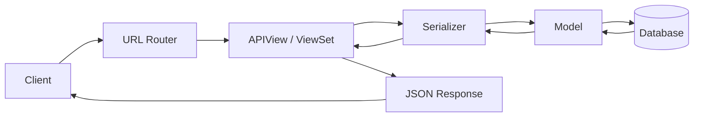
1. Client

The client (browser, Postman, or mobile application) sends an HTTP request such as GET, POST, PUT, or DELETE to the API.

2. URL Router

The URL router receives the incoming request and maps it to the appropriate API endpoint defined in urls.py.

3. View / ViewSet

The View or ViewSet contains the business logic. It processes the request, checks permissions, communicates with the serializer and model, and determines the appropriate response.

4. Serializer

The serializer validates incoming request data and converts it into Python objects. It also converts model instances into JSON format before sending the response to the client.

5. Model

The model represents the database structure and handles all interactions with the database using Django's ORM.

6. Database

The database stores all application data, including users, categories, expenses, and uploaded receipt information.

7. JSON Response

After processing the request, the serializer converts the data into JSON format, and the API sends it back to the client with the appropriate HTTP status code.

# CRUD Operations using ModelViewSet

Both `CategoryViewSet` and `ExpenseViewSet` inherit from Django REST Framework's `ModelViewSet`.

```python
class CategoryViewSet(viewsets.ModelViewSet):
```

```python
class ExpenseViewSet(viewsets.ModelViewSet):
```

By inheriting from `ModelViewSet`, Django REST Framework automatically provides all standard **CRUD (Create, Read, Update, Delete)** operations. This eliminates the need to manually implement common API methods, reducing boilerplate code and improving maintainability.

---

## Built-in CRUD Operations

| HTTP Method | Endpoint                | Operation                   | Built-in Method    |
| ----------- | ----------------------- | --------------------------- | ------------------ |
| `GET`       | `/api/categories/`      | Retrieve all categories     | `list()`           |
| `GET`       | `/api/categories/{id}/` | Retrieve a single category  | `retrieve()`       |
| `POST`      | `/api/categories/`      | Create a new category       | `create()`         |
| `PUT`       | `/api/categories/{id}/` | Update an existing category | `update()`         |
| `PATCH`     | `/api/categories/{id}/` | Partially update a category | `partial_update()` |
| `DELETE`    | `/api/categories/{id}/` | Delete a category           | `destroy()`        |

The same CRUD operations are automatically available for the **Expense** API.

---

## Custom Configuration

Although `ModelViewSet` provides all CRUD operations automatically, the following attributes and methods are configured to customize the API behavior.

| Configuration        | Purpose                                                                      |
| -------------------- | ---------------------------------------------------------------------------- |
| `serializer_class`   | Specifies the serializer used for request validation and JSON serialization. |
| `permission_classes` | Restricts API access to authenticated users.                                 |
| `get_queryset()`     | Returns only the records belonging to the currently authenticated user.      |
| `perform_create()`   | Automatically associates the logged-in user with newly created records.      |

---

## Why Use ModelViewSet?

Using `ModelViewSet` offers several advantages:

* Automatically implements all CRUD operations.
* Reduces repetitive code.
* Follows RESTful API best practices.
* Easily integrates with serializers, permissions, filtering, and authentication.
* Produces cleaner, more maintainable, and scalable code.

---

## CRUD Workflow

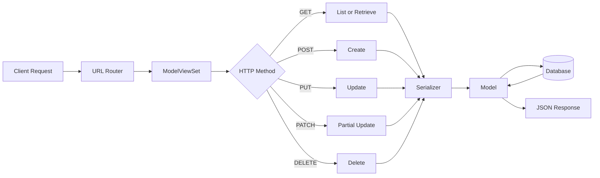

#  Django Admin Panel

The project uses Django's built-in **Admin Panel** to manage application data through a secure web interface. Administrators can perform CRUD operations on categories and expenses without interacting directly with the database.

---

## Admin Features

| Feature           | Description                                                          |
| ----------------- | -------------------------------------------------------------------- |
| `ModelAdmin`      | Customizes the appearance and behavior of models in the admin panel. |
| `list_display`    | Displays selected model fields as columns in the admin list view.    |
| `search_fields`   | Enables searching records using specific fields.                     |
| `list_filter`     | Adds sidebar filters for quick data filtering.                       |
| `readonly_fields` | Prevents modification of automatically generated fields.             |
| `TabularInline`   | Displays related expenses directly within the category page.         |

---

## Jazzmin Integration

The admin interface is enhanced using **Django Jazzmin**, which provides a modern and user-friendly dashboard.

### Features

* Modern dashboard interface
* Responsive design
* Sidebar navigation
* Improved icons and layout
* Dark mode support
* Better user experience

---

## Admin Workflow

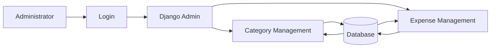
# 🎛️ Django Admin Panel

The project uses Django's built-in Admin Panel with **Jazzmin** to provide a modern, responsive, and user-friendly administrative interface.

## Jazzmin Admin Dashboard

The screenshot below shows the customized Django Admin Panel using Jazzmin.

<p align="center">
    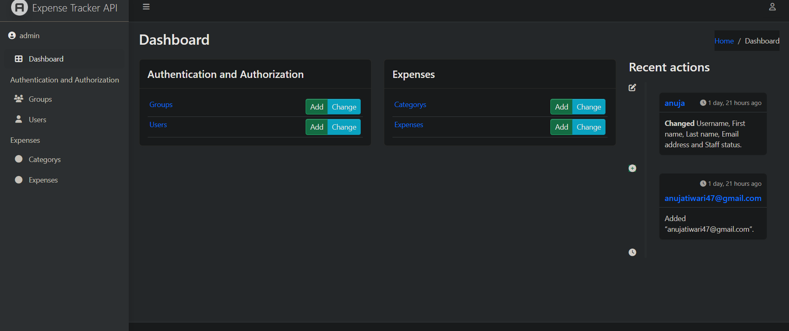
</p>

---

## Category Administration

The `CategoryAdmin` class customizes how category records are displayed and managed.

| Configuration     | Purpose                                             |
| ----------------- | --------------------------------------------------- |
| `list_display`    | Displays ID, name, user, and creation date.         |
| `search_fields`   | Searches categories by name and username.           |
| `list_filter`     | Filters categories by creation date.                |
| `readonly_fields` | Prevents editing of the creation timestamp.         |
| `inlines`         | Displays related expenses within the category page. |

---

##  Category Management

The Category page allows administrators to create, update, search, and filter categories.

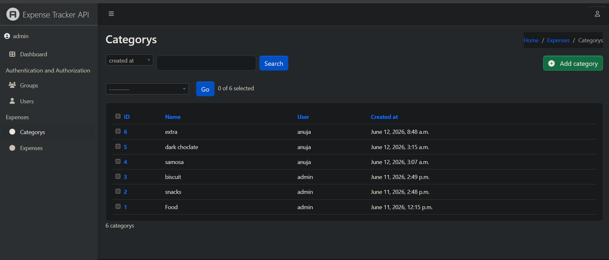


## Expense Administration

The `ExpenseAdmin` class customizes expense management.

| Configuration     | Purpose                                                   |
| ----------------- | --------------------------------------------------------- |
| `list_display`    | Displays expense details in tabular format.               |
| `search_fields`   | Searches expenses by title, note, username, and category. |
| `list_filter`     | Filters expenses by category, date, and creation time.    |
| `readonly_fields` | Prevents editing of automatically generated timestamps.   |

---

##  Expense Management

Administrators can manage expenses, upload receipts, and search or filter records.

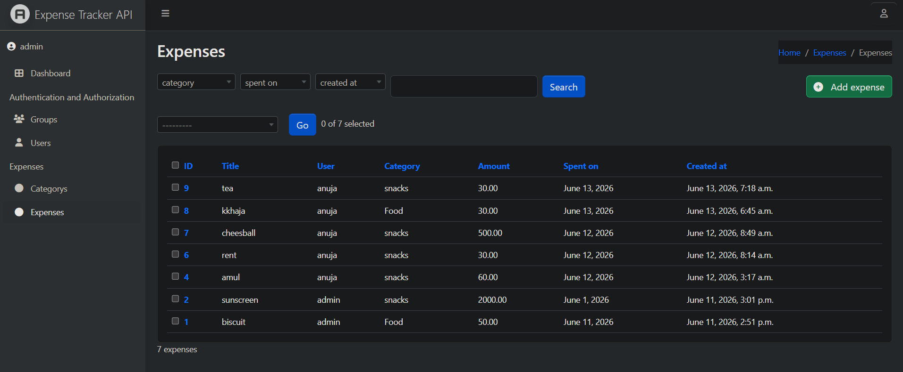

## Benefits

* Simplifies data management.
* Eliminates the need for manual SQL queries.
* Provides secure administrative access.
* Supports searching and filtering.
* Improves productivity with inline editing.
* Enhanced user interface using Jazzmin.

---

## Accessing the Admin Panel

```text
http://127.0.0.1:8000/admin/
```

Log in using a superuser account created with:

```bash
python manage.py createsuperuser
```
##  JWT Authentication

The API endpoints are protected using authentication. In the ViewSets, the following permission is used:

```python
permission_classes = [IsAuthenticated]
```

This means only logged-in users with valid authentication credentials can access protected endpoints such as:

```text
/api/categories/
/api/expenses/
```

If a user tries to access these endpoints without authentication, the API returns an error message.

```json
{
    "detail": "Authentication credentials were not provided."
}
```

### Unauthenticated Request Screenshot

<p align="center">
  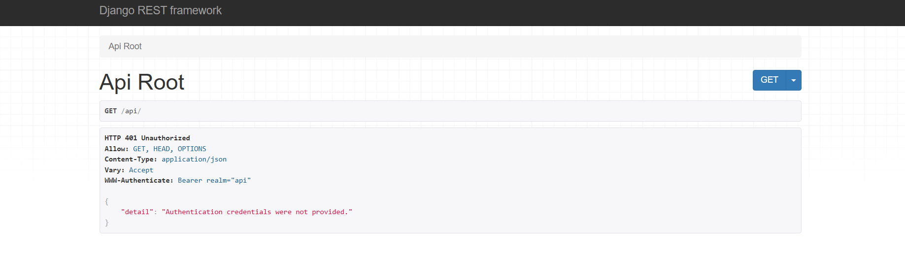
</p>

---

## JWT Token URLs

JWT authentication is implemented using **Django REST Framework Simple JWT**.

```python
from rest_framework_simplejwt.views import TokenObtainPairView, TokenRefreshView
```

```python
urlpatterns = [
    path("api/token/", TokenObtainPairView.as_view(), name="token_obtain_pair"),
    path("api/token/refresh/", TokenRefreshView.as_view(), name="token_refresh"),
]
```

### Explanation

| URL                   | Purpose                                                              |
| --------------------- | -------------------------------------------------------------------- |
| `/api/token/`         | Accepts username and password and returns access and refresh tokens. |
| `/api/token/refresh/` | Accepts a refresh token and returns a new access token.              |

The views `TokenObtainPairView` and `TokenRefreshView` are provided by the **Simple JWT** package, so they do not need to be created manually inside `views.py`.

The `.as_view()` method is used because these are class-based views. It converts the class-based view into a callable view that Django can use in `urls.py`.

---

## Getting JWT Token

To get a JWT token, send a `POST` request to:

```text
/api/token/
```

With the following body:

```json
{
    "username": "your_username",
    "password": "your_password"
}
```

If the login credentials are correct, the API returns:

```json
{
    "refresh": "your_refresh_token",
    "access": "your_access_token"
}
```

### JWT Login Screenshot

<p align="center">
  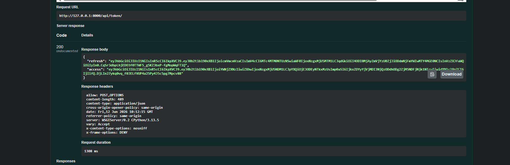
</p>

---

## Using Access Token

After receiving the access token, include it in the request header when accessing protected APIs.

```text
Authorization: Bearer your_access_token
```

Example protected endpoint:

```text
GET /api/categories/
```

Now the authenticated user can access their own categories and expenses.

---

## Authentication Flow

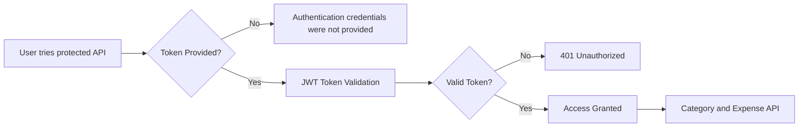

#  API Documentation

The project uses **drf-yasg** to automatically generate interactive API documentation.

The `get_schema_view()` function scans the project's URLs, serializers, and ViewSets to generate OpenAPI (Swagger) documentation without requiring manual documentation for each endpoint.

## Features

- Automatic API documentation generation
- Interactive Swagger UI
- OpenAPI specification support
- Request and response schema visualization
- Endpoint testing directly from the browser

### Swagger UI

```
http://127.0.0.1:8000/swagger/
```

### ReDoc

```
http://127.0.0.1:8000/redoc/
```

### Swagger Screenshot

<p align="center">
  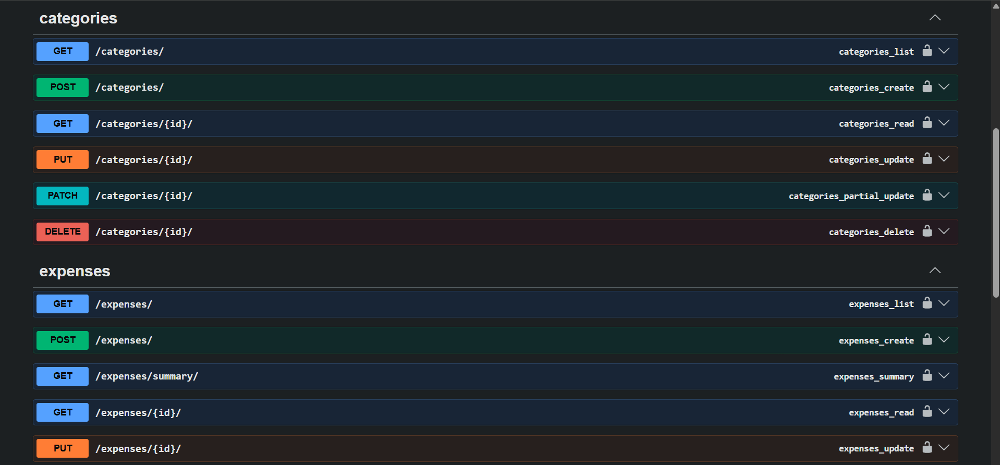
</p>

##  Monthly Expense Summary Email

The Expense Tracker API can automatically generate a monthly expense summary and send it to the authenticated user's registered email address.

The summary is generated using Django's `send_mail()` function and includes the total expenses for the selected month and year.

### Features

* Sends email to the logged-in user.
* Calculates total monthly expenses automatically.
* Accepts `month` and `year` as query parameters.
* Uses Gmail SMTP for email delivery.
* Returns a success response after the email is sent.

---

### API Endpoint

```http
GET /api/expenses/summary/?month=6&year=2026
```

### Query Parameters

| Parameter | Type    | Required | Description                 |
| --------- | ------- | -------- | --------------------------- |
| `month`   | Integer | Yes      | Month number (1–12)         |
| `year`    | Integer | Yes      | Year of the expense summary |

### Success Response

```json
{
    "message": "Monthly summary email sent successfully."
}
```

---

## Email Workflow

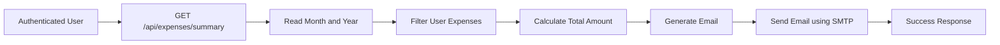

---

## Email Preview

The following screenshot shows the monthly expense summary email received by the user.

<p align="center">
    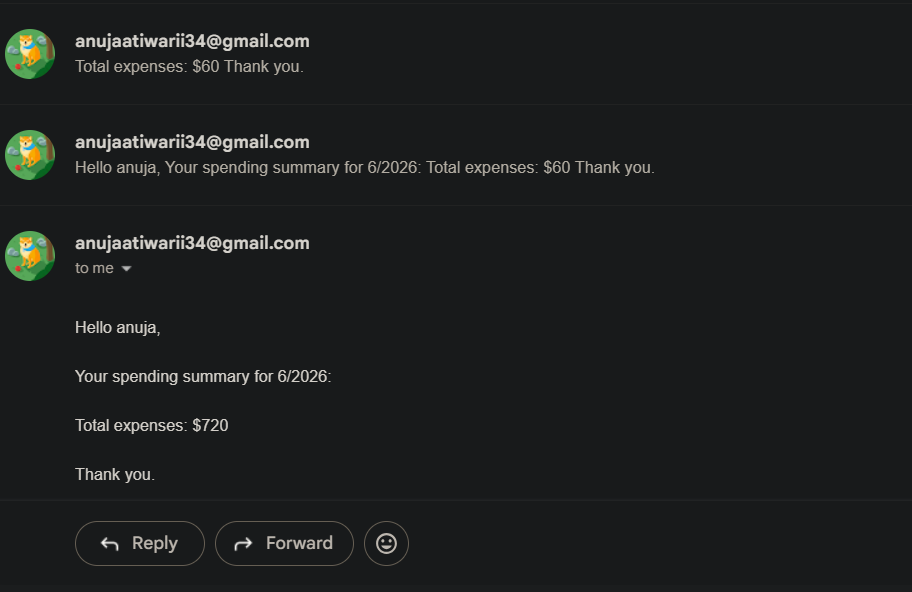
</p>

---

### Email Example

```text
Subject: Monthly Expense Summary

Hello john,

Your spending summary for 6/2026:

Total expenses: $250.75

Thank you.
```

# Parser Configuration Fix

Initially, the project used the `self.action` attribute inside the `get_parsers()` method to determine which parser should handle incoming requests.

### Previous Implementation

```python
def get_parsers(self):
    if self.action in ["create", "update", "partial_update"]:
        return [MultiPartParser(), FormParser()]
    return [JSONParser()]
```

## Issue

While testing the API in Swagger UI, an error occurred because `self.action` is not always available when the `get_parsers()` method is executed. As a result, the parser could not be selected correctly.

## Solution

The parser selection logic was updated to use the HTTP request method instead of `self.action`.

### Updated Implementation

```python
def get_parsers(self):
    if self.request.method in ["POST", "PUT", "PATCH"]:
        return [MultiPartParser(), FormParser()]
    return [JSONParser()]
```

Using `self.request.method` is more reliable because the HTTP request method (`POST`, `PUT`, `PATCH`) is always available when parser selection occurs.

---

# Parser Order Update

The parser order was also modified.

### Before

```python
parser_classes = [JSONParser, MultiPartParser, FormParser]
```

### After

```python
parser_classes = [MultiPartParser, FormParser, JSONParser]
```

## Why was this changed?

Placing `MultiPartParser` and `FormParser` before `JSONParser` ensures that Django REST Framework correctly processes `multipart/form-data` requests.

This allows Swagger UI to display a file upload control for the `receipt` field while still supporting JSON requests for other API operations.

---

# Benefits

- Prevents `self.action` related errors.
- Correctly supports file uploads in Swagger UI.
- Handles `multipart/form-data` requests properly.
- Continues to support JSON requests for GET operations.
- Improves compatibility with Django REST Framework parser selection.

# Generate Requirements File

The project dependencies are stored in a `requirements.txt` file, allowing other developers to install all required packages with a single command.

## Create `requirements.txt`

Run the following command in the project root directory:

```bash
pip freeze > requirements.txt
```

This command lists all installed Python packages and their versions and saves them to the `requirements.txt` file.

### Example

```txt
Django==5.2.1
djangorestframework==3.16.0
djangorestframework-simplejwt==5.5.1
drf-yasg==1.21.10
django-filter==25.1
django-environ==0.12.0
Pillow==11.2.1
PyJWT==2.10.1
```

## Install Dependencies

After cloning the repository, install all required packages using:

```bash
pip install -r requirements.txt
```

This installs every dependency required to run the project.

